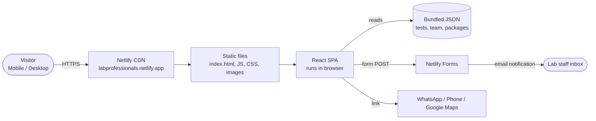
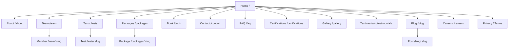
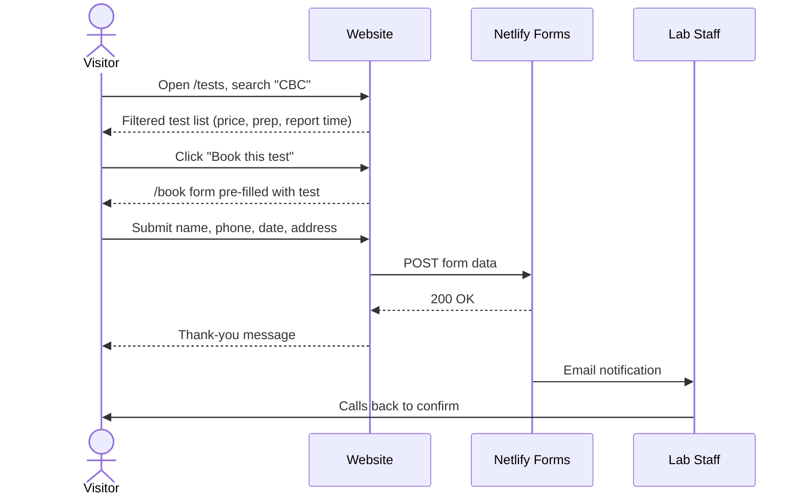
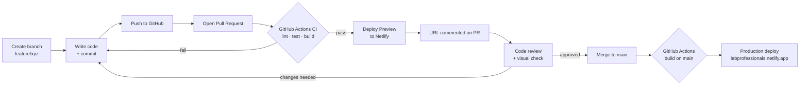

# Lab Professional Website – High-Level Design (HLD)

| | |
|---|---|
| **Status** | Draft v0.1 |
| **Last updated** | 2026-09-23 |
| **Related docs** | [Low-Level Design](02-low-level-design.md) · [CI/CD](03-cicd-github-actions.md) · [Client Questionnaire](../functional-spec/client-questionnaire.md) |

---

## 1. Overview

This is a portfolio website for a diagnostic lab. It presents the lab, its team, its tests and packages. Visitors can contact the lab or request a booking.

The site is a **static single-page application (SPA)** built with React. It has no custom backend or database. Forms are handled by Netlify Forms. Hosting on Netlify's free plan is the target.

### 1.1 Goals
- Fast, mobile-first site that builds trust in the lab
- Visitors can reach the lab in one step: call, WhatsApp or form
- Content (tests, team, packages) can be updated by editing data files, without touching components
- Every change is reviewed and deployed automatically: code → PR → checks → preview → production

### 1.2 Out of scope (v1)
- Online payments
- Patient login / report download
- Admin panel / CMS (possible later with Decap CMS)

---

## 2. Tech Stack

| Layer | Choice | Why |
|---|---|---|
| UI library | **React 19** | Component-based, large ecosystem, team familiarity |
| Build tool | **Vite** | Fast dev server and builds; Create React App is deprecated |
| Routing | **React Router v7** | Standard client-side routing for React |
| Styling | **CSS Modules** + global CSS variables | Scoped styles with no runtime cost; theming through variables |
| Language | JavaScript (ES2022+) with JSDoc, TypeScript optional | Low barrier; can migrate later |
| Content | JSON files (tests, team, packages) + Markdown (blog) | No backend needed; easy to edit |
| Forms | **Netlify Forms** | Free submissions with no server code |
| Testing | **Vitest** + React Testing Library | Native to Vite, fast |
| Code quality | ESLint + Prettier | Consistent code style |
| Source control | **GitHub** | PRs, reviews, Actions |
| CI/CD | **GitHub Actions** | Lint, test, build and deploy on every PR and merge |
| Hosting | **Netlify** (free plan) | Static hosting, CDN, HTTPS, forms |
| Runtime | Node.js 22 LTS (build only) | |

---

## 3. System Architecture

**How it works:**
1. The visitor opens the site. Netlify's CDN serves `index.html` and the JS/CSS bundle.
2. React Router renders the right page in the browser. The content comes from JSON bundled with the app.
3. Contact and booking forms POST to Netlify, which stores the submission and emails the lab.
4. Call, WhatsApp and map buttons open external apps. No backend is involved.

---

## 4. Site Map

**Phase 1 (launch):** Home, About, Team, Tests, Packages, Book, Contact, 404
**Phase 2:** FAQ, Certifications, Testimonials, Gallery, Privacy, Terms
**Phase 3:** Blog, Careers, detail pages

---

## 5. Key User Flows

### 5.1 Find a test and book it

### 5.2 Quick contact
Visitor → any page → sticky **WhatsApp / Call** button → opens WhatsApp chat or phone dialer.

### 5.3 Content update
Developer edits `src/data/tests.json` → opens PR → preview is checked → merge → live in about 2 minutes.

---

## 6. Development & Deployment Flow

| Stage | Trigger | What happens |
|---|---|---|
| **Develop** | Local | `npm run dev` on a feature branch |
| **CI** | Every push to a PR | Install → Lint → Test → Build |
| **Preview** | CI passes on a PR | Build is uploaded to Netlify as a draft; the unique URL is posted on the PR |
| **Review** | Manual | At least 1 approval; all checks green |
| **Production** | Merge to `main` | Build is deployed to Netlify with `--prod` |
| **Rollback** | Manual | One-click "Publish deploy" on an older deploy in the Netlify dashboard |

**Design decision:** GitHub Actions builds and deploys. Netlify only hosts the files, and Netlify's own auto-build is switched off. This keeps all pipeline logic in one place, lets deploys wait for tests, and uses GitHub's free Actions minutes instead of Netlify build credits.

---

## 7. Environments

| Environment | URL | Source |
|---|---|---|
| Local | `http://localhost:5173` | Developer machine |
| Preview | `https://pr-<number>--labprofessionals.netlify.app` | Each open PR |
| Production | `https://labprofessionals.netlify.app` | `main` branch |

---

## 8. Non-Functional Requirements

| Area | Target |
|---|---|
| **Performance** | Lighthouse Performance ≥ 90 on mobile; initial JS < 200 KB gzipped; images in WebP and lazy-loaded |
| **SEO** | Unique title and meta description per page; `sitemap.xml`; `robots.txt`; Open Graph tags; LocalBusiness / MedicalBusiness JSON-LD |
| **Accessibility** | WCAG 2.1 AA; keyboard navigable; alt text on all images; colour contrast ≥ 4.5:1 |
| **Responsive** | Mobile-first; tested at 360px, 768px, 1280px |
| **Browsers** | Latest 2 versions of Chrome, Safari, Firefox, Edge |
| **Security** | HTTPS only; security headers (CSP, X-Frame-Options); no secrets in the repo; honeypot spam protection on forms |
| **Privacy** | Only the minimum patient data collected; privacy policy page; no medical data stored on the site |
| **Availability** | Netlify CDN (managed) |
| **Cost** | ₹0 / month, excluding an optional custom domain |

---

## 9. Free Plan Limits & Risks

| Risk | Mitigation |
|---|---|
| Netlify free usage limits (bandwidth, deploys, form submissions) | Optimise images; watch usage in the dashboard; check current limits at netlify.com/pricing |
| Form spam | Honeypot field and Netlify spam filtering |
| SPA pages not indexed well by search engines | Per-page meta tags, sitemap; add pre-rendering later if needed |
| Refreshing a deep link returns 404 | `_redirects` rule `/* /index.html 200` |
| Secrets leaked | Netlify token kept only in GitHub Secrets |

---

## 10. Open Questions
- Custom domain or `.netlify.app`? (Questionnaire §13)
- Languages: English only or multilingual? (Questionnaire §3.5)
- Who updates content after launch? Decides whether we add a CMS. (Questionnaire §13.3)
