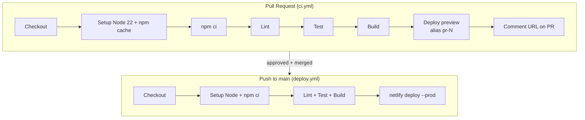

# Lab Professional Website – Low-Level Design (LLD)

| | |
|---|---|
| **Status** | Draft v0.1 |
| **Last updated** | 2026-09-23 |
| **Related docs** | [High-Level Design](01-high-level-design.md) · [CI/CD](03-cicd-github-actions.md) |

---

## 1. Project Structure

```
LabProfessionalWebsite/
├── .github/
│   ├── workflows/
│   │   ├── ci.yml                 # PR: lint, test, build, preview deploy
│   │   └── deploy.yml             # main: production deploy
│   └── pull_request_template.md
├── docs/
│   ├── functional-spec/
│   └── tech-spec/
├── public/
│   ├── _redirects                 # SPA fallback
│   ├── robots.txt
│   ├── sitemap.xml
│   ├── favicon.png
│   └── images/                    # optimised WebP images
├── src/
│   ├── main.jsx                   # entry: mounts <App/>
│   ├── App.jsx                    # router + layout
│   ├── routes.jsx                 # route table
│   ├── components/
│   │   ├── layout/                # Header, Footer, Layout, MobileNav
│   │   ├── ui/                    # Button, Card, Badge, Accordion, Modal
│   │   └── common/                # SEO, WhatsAppButton, SectionTitle, ScrollToTop
│   ├── features/
│   │   ├── tests/                 # TestCard, TestList, TestFilters, useTestSearch
│   │   ├── team/                  # MemberCard, MemberProfile
│   │   ├── packages/              # PackageCard
│   │   ├── booking/               # BookingForm, validation
│   │   └── contact/               # ContactForm, MapEmbed
│   ├── pages/                     # one file per route (thin; composes features)
│   │   ├── HomePage.jsx
│   │   ├── AboutPage.jsx
│   │   ├── TeamPage.jsx
│   │   ├── MemberPage.jsx
│   │   ├── TestsPage.jsx
│   │   ├── TestDetailPage.jsx
│   │   ├── PackagesPage.jsx
│   │   ├── BookPage.jsx
│   │   ├── ContactPage.jsx
│   │   ├── FaqPage.jsx
│   │   └── NotFoundPage.jsx
│   ├── data/                      # all editable content
│   │   ├── site.json              # name, phone, address, hours, socials
│   │   ├── team.json
│   │   ├── tests.json
│   │   ├── packages.json
│   │   ├── faqs.json
│   │   └── testimonials.json
│   ├── hooks/                     # useDocumentTitle, useMediaQuery
│   ├── utils/                     # formatPrice, slugify, encodeForm
│   └── styles/
│       ├── variables.css          # colours, spacing, fonts (design tokens)
│       ├── reset.css
│       └── global.css
├── tests/                         # (or co-located *.test.jsx)
├── index.html                     # also holds hidden Netlify form definitions
├── netlify.toml
├── vite.config.js
├── eslint.config.js
├── .prettierrc
├── .nvmrc                         # 22
└── package.json
```

**Rules**
- `pages/` only compose components. No business logic there.
- `features/` holds domain components plus their hooks and tests.
- `components/ui/` holds dumb, reusable components with no data imports.
- Content lives only in `src/data/`. No hard-coded phone numbers or prices in JSX.

---

## 2. Routing

Defined in `src/routes.jsx` using `createBrowserRouter`. Pages are lazy-loaded so each route is its own JS chunk.

| Path | Page | Phase |
|---|---|---|
| `/` | HomePage | 1 |
| `/about` | AboutPage | 1 |
| `/team` | TeamPage | 1 |
| `/team/:slug` | MemberPage | 3 |
| `/tests` | TestsPage | 1 |
| `/tests/:slug` | TestDetailPage | 3 |
| `/packages` | PackagesPage | 1 |
| `/packages/:slug` | PackageDetailPage | 3 |
| `/book` | BookPage (accepts `?test=<slug>`) | 1 |
| `/contact` | ContactPage | 1 |
| `/faq` | FaqPage | 2 |
| `/certifications` | CertificationsPage | 2 |
| `/gallery` | GalleryPage | 2 |
| `/testimonials` | TestimonialsPage | 2 |
| `/privacy` · `/terms` | LegalPage | 2 |
| `/blog` · `/blog/:slug` | BlogPage · PostPage | 3 |
| `/careers` | CareersPage | 3 |
| `*` | NotFoundPage | 1 |

```jsx
// src/routes.jsx (sketch)
const TestsPage = lazy(() => import('./pages/TestsPage'));

export const router = createBrowserRouter([
  {
    element: <Layout />,          // Header + <Outlet/> + Footer
    errorElement: <NotFoundPage />,
    children: [
      { path: '/', element: <HomePage /> },
      { path: '/tests', element: <TestsPage /> },
      { path: '/tests/:slug', element: <TestDetailPage /> },
      // ...
      { path: '*', element: <NotFoundPage /> },
    ],
  },
]);
```

A detail page with an unknown slug renders `NotFoundPage`.

---

## 3. Data Models

All content is JSON, validated by a unit test (see §9), so a typo fails CI instead of breaking production.

### 3.1 `site.json`
```json
{
  "name": "ABC Diagnostics",
  "tagline": "Accurate reports. On time. Every time.",
  "phone": "+91XXXXXXXXXX",
  "whatsapp": "91XXXXXXXXXX",
  "email": "info@example.com",
  "address": "…",
  "mapEmbedUrl": "https://www.google.com/maps/embed?pb=…",
  "hours": [{ "days": "Mon–Sat", "time": "7:00 AM – 9:00 PM" }],
  "socials": { "instagram": "…", "facebook": "…" },
  "stats": [{ "label": "Tests done", "value": "50,000+" }],
  "accreditations": ["NABL", "ISO 15189"]
}
```

### 3.2 `tests.json`
```json
[
  {
    "slug": "cbc",
    "name": "Complete Blood Count (CBC)",
    "category": "Hematology",
    "price": 350,
    "sampleType": "Blood",
    "reportTime": "Same day",
    "preparation": "No fasting required",
    "description": "…",
    "popular": true
  }
]
```

### 3.3 `team.json`
```json
[
  {
    "slug": "dr-a-sharma",
    "name": "Dr. A. Sharma",
    "title": "MD Pathology",
    "role": "Chief Pathologist",
    "experienceYears": 15,
    "photo": "/images/team/a-sharma.webp",
    "bio": "…",
    "specializations": ["Histopathology"],
    "order": 1
  }
]
```

### 3.4 `packages.json`
```json
[
  {
    "slug": "full-body-checkup",
    "name": "Full Body Checkup",
    "price": 2999,
    "offerPrice": 1999,
    "testSlugs": ["cbc", "lft", "kft", "lipid-profile"],
    "highlight": true
  }
]
```
`testSlugs` must reference existing entries in `tests.json`. This is checked by the data test.

---

## 4. Key Components

| Component | Responsibility | Props / notes |
|---|---|---|
| `Layout` | Header, `<Outlet/>`, Footer, floating WhatsApp button, scroll-to-top on route change | — |
| `Header` | Logo, nav links, mobile hamburger menu, "Book Now" CTA | Reads nav from a constant |
| `Footer` | Contact info, hours, socials, legal links | Reads `site.json` |
| `SEO` | Renders `<title>`, `<meta>`, canonical and OG tags using React 19's built-in metadata hoisting | `title`, `description`, `image`, `path` |
| `TestList` + `TestFilters` | Search by name, filter by category, sort by price | Uses `useTestSearch` |
| `useTestSearch(tests, query, category)` | Returns filtered list; memoised | Pure. Unit tested. |
| `PackageCard` | Shows price, strikes through the original, lists included tests | `package` |
| `BookingForm` | Netlify form; pre-fills test from `?test=` | See §5 |
| `ContactForm` | Netlify form | See §5 |
| `WhatsAppButton` | Floating link to `https://wa.me/<number>?text=…` | Message is pre-filled |
| `Accordion` | Used by FAQ; accessible (`aria-expanded`) | `items` |

### State management
No global state library. The site is read-only content, so this is enough:
- **Local state** (`useState`) for forms, filters and the mobile menu
- **URL state** (`useSearchParams`) for test search and filter, so filtered links can be shared
- Data is imported directly: `import tests from '@/data/tests.json'`

---

## 5. Forms (Netlify Forms)

Netlify detects forms by reading the static HTML at deploy time. React renders forms in JavaScript, so we:

1. **Declare hidden copies in `index.html`** so Netlify registers them:
```html
<form name="booking" netlify netlify-honeypot="bot-field" hidden>
  <input name="name" /><input name="phone" /><input name="test" />
  <input name="date" /><input name="address" /><textarea name="message"></textarea>
</form>
<form name="contact" netlify netlify-honeypot="bot-field" hidden>
  <input name="name" /><input name="phone" /><input name="email" />
  <textarea name="message"></textarea>
</form>
```

2. **Submit from React with `fetch`:**
```js
// src/utils/encodeForm.js
export const encodeForm = (data) =>
  new URLSearchParams(data).toString();

// in BookingForm
await fetch('/', {
  method: 'POST',
  headers: { 'Content-Type': 'application/x-www-form-urlencoded' },
  body: encodeForm({ 'form-name': 'booking', ...values }),
});
```

3. **Flow and states:** `idle → submitting → success | error`
   - Client-side validation before submit: name required; phone matches `^[6-9]\d{9}$` (India); date not in the past
   - On success: show a thank-you panel and a WhatsApp link
   - On error: show a message with the phone number as a fallback

4. **Notifications:** Netlify dashboard → Forms → Notifications → email to the lab.

5. **Spam:** a hidden `bot-field` honeypot, plus Netlify's built-in filter.

---

## 6. Styling & Design System

- **CSS Modules** per component (`Button.module.css`)
- **Design tokens** in `src/styles/variables.css`:
```css
:root {
  --color-primary: #0B6E99;     /* clinical blue, final colours from client */
  --color-accent: #16A34A;      /* trust green / CTA */
  --color-text: #1F2937;
  --color-bg: #FFFFFF;
  --color-surface: #F3F6F9;
  --font-body: 'Inter', system-ui, sans-serif;
  --radius: 12px;
  --space-1: 4px; --space-2: 8px; --space-4: 16px; --space-8: 32px;
  --container: 1200px;
}
[data-theme='dark'] { /* dark overrides */ }
```
- **Mobile-first breakpoints:** `min-width: 640px`, `768px`, `1024px`, `1280px`
- **Layout:** CSS Grid for page sections, Flexbox for components
- **Icons:** `lucide-react` (tree-shakeable)
- **Images:** WebP, explicit `width`/`height`, `loading="lazy"` below the fold

---

## 7. SEO Implementation

| Item | How |
|---|---|
| Page title / description | `<SEO>` component on every page (React 19 hoists `<title>`/`<meta>` into `<head>`) |
| Canonical URL | `<link rel="canonical">` in `<SEO>` |
| Social previews | Open Graph + Twitter card tags; default OG image in `public/` |
| Structured data | `MedicalBusiness` JSON-LD on Home, built from `site.json` |
| Sitemap | `public/sitemap.xml`, regenerated by a script (`npm run sitemap`) from routes and data |
| Robots | `public/robots.txt` pointing to the sitemap |

---

## 8. Netlify Configuration

### 8.1 `public/_redirects`
```
/*    /index.html   200
```

### 8.2 `netlify.toml`
```toml
[build]
  publish = "dist"
  # Builds run in GitHub Actions; Netlify only hosts.

[[headers]]
  for = "/*"
  [headers.values]
    X-Frame-Options = "DENY"
    X-Content-Type-Options = "nosniff"
    Referrer-Policy = "strict-origin-when-cross-origin"
    Permissions-Policy = "camera=(), microphone=(), geolocation=()"
    Content-Security-Policy = "default-src 'self'; img-src 'self' data: https:; style-src 'self' 'unsafe-inline' https://fonts.googleapis.com; font-src https://fonts.gstatic.com; frame-src https://www.google.com; script-src 'self'"

[[headers]]
  for = "/assets/*"
  [headers.values]
    Cache-Control = "public, max-age=31536000, immutable"
```

### 8.3 One-time Netlify setup
1. Create the site in Netlify and name it `labprofessionals`
2. **Site settings → Build & deploy → Stop builds** (GitHub Actions does the building)
3. Copy the **Site ID** (Site settings → General)
4. Create a **Personal Access Token** (User settings → Applications)
5. Add both to GitHub: **Repo → Settings → Secrets and variables → Actions**
   - `NETLIFY_AUTH_TOKEN`
   - `NETLIFY_SITE_ID`
6. Enable **Forms** detection and add an email notification

---

## 9. Testing Strategy

| Type | Tool | What is covered |
|---|---|---|
| Unit | Vitest | `useTestSearch`, `formatPrice`, `encodeForm`, form validation |
| Component | React Testing Library | TestList filtering, BookingForm validation and submit states, Header mobile menu |
| Data integrity | Vitest | Every JSON file matches its schema; slugs unique; package `testSlugs` exist; image paths exist |
| Smoke | Vitest + Router | Every route renders without crashing |
| Manual | Deploy preview | Visual check on mobile and desktop before approving the PR |
| Optional | Lighthouse CI | Performance/SEO/a11y scores ≥ 90 on the preview URL |

Coverage target: **≥ 70 %** on `features/`, `hooks/` and `utils/`.

---

## 10. Git Workflow

### 10.1 Branching
- `main` is always deployable and protected
- Feature branches come off `main`:

| Prefix | Use | Example |
|---|---|---|
| `feature/` | New page or feature | `feature/test-catalog` |
| `fix/` | Bug fix | `fix/mobile-nav-overlap` |
| `content/` | Data / text change only | `content/update-prices-oct` |
| `chore/` | Tooling, deps, config | `chore/upgrade-vite` |
| `docs/` | Documentation | `docs/tech-spec` |

### 10.2 Commit messages ([Conventional Commits](https://www.conventionalcommits.org))
```
feat(tests): add category filter to test catalog
fix(header): close mobile menu on route change
content(packages): update diwali offer prices
chore(deps): bump react-router to 7.x
```

### 10.3 Branch protection on `main`
- Require a pull request before merging
- Require 1 approval
- Require status checks to pass: `Lint, test & build`
- Require the branch to be up to date before merging
- No direct pushes or force pushes
- Squash merge only, so there is one clean commit per PR

### 10.4 PR template (`.github/pull_request_template.md`)
```markdown
## What
<!-- short description -->

## Why
<!-- link to issue / questionnaire section -->

## Screenshots (mobile + desktop)

## Checklist
- [ ] Tested locally (`npm run dev`)
- [ ] `npm run lint && npm test` pass
- [ ] Checked on the deploy preview (mobile + desktop)
- [ ] Alt text on new images
- [ ] Content added to `src/data/` (not hard-coded)
```

---

## 11. CI/CD Pipelines (GitHub Actions)



Full workflow files, one-time setup, troubleshooting and rollback steps are in **[03 – CI/CD with GitHub Actions & Netlify](03-cicd-github-actions.md)**.

---

## 12. npm Scripts

```json
{
  "scripts": {
    "dev": "vite",
    "build": "vite build",
    "preview": "vite preview",
    "lint": "eslint . && prettier --check .",
    "format": "prettier --write .",
    "test": "vitest",
    "coverage": "vitest run --coverage",
    "sitemap": "node scripts/generate-sitemap.js"
  }
}
```

---

## 13. Developer Onboarding

```bash
git clone https://github.com/<org>/LabProfessionalWebsite.git
cd LabProfessionalWebsite
nvm use            # Node 22
npm ci
npm run dev        # http://localhost:5173

git checkout -b feature/my-change
# ...code...
npm run lint && npm test -- --run
git commit -m "feat(scope): message"
git push -u origin feature/my-change
# open PR on GitHub → wait for checks + preview URL → request review
```

---

## 14. Implementation Checklist (Phase 1)

- [ ] Scaffold Vite + React, ESLint, Prettier, Vitest
- [ ] `netlify.toml`, `_redirects`, `.nvmrc`
- [ ] Netlify site + secrets in GitHub
- [ ] `ci.yml`, `deploy.yml`, PR template, branch protection
- [ ] Design tokens + Layout (Header, Footer, WhatsApp button)
- [ ] `site.json`, `team.json`, `tests.json`, `packages.json` with sample data
- [ ] Pages: Home, About, Team, Tests, Packages, Book, Contact, 404
- [ ] Netlify Forms: booking + contact, email notifications
- [ ] SEO component, sitemap, robots.txt
- [ ] Lighthouse ≥ 90 on mobile
- [ ] Replace sample data with the client's real content
