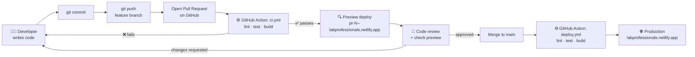
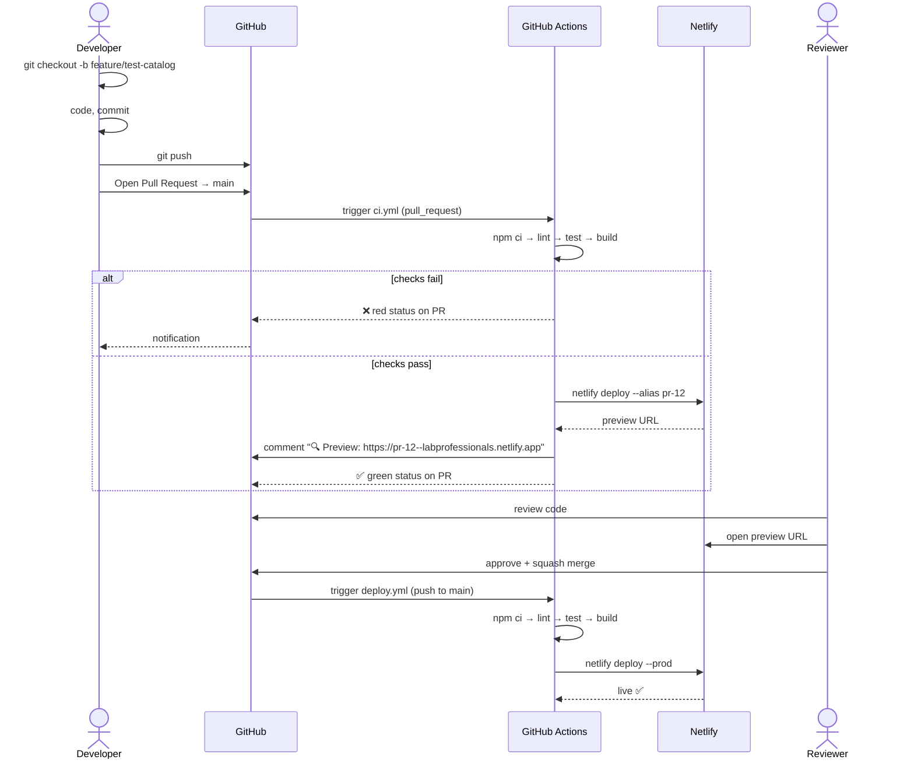

# Lab Professional Website – CI/CD with GitHub Actions & Netlify

| | |
|---|---|
| **Status** | Draft v0.1 |
| **Last updated** | 2026-09-23 |
| **Related docs** | [High-Level Design](01-high-level-design.md) · [Low-Level Design](02-low-level-design.md) |
| **Production URL** | https://labprofessionals.netlify.app |

This document is the single source of truth for how code gets from a developer's laptop to the live website.

---

## 1. The Big Picture



**In one sentence:** every change goes through a Pull Request. GitHub Actions checks it and gives it a preview link. After approval and merge, the site goes live automatically.

---

## 2. Step-by-Step Flow

| # | Who | Action | Where |
|---|---|---|---|
| 1 | Developer | Create a branch from `main` | Laptop |
| 2 | Developer | Write code and run it locally (`npm run dev`) | Laptop |
| 3 | Developer | Run checks locally (`npm run lint && npm test -- --run`) | Laptop |
| 4 | Developer | Commit and push the branch | Laptop → GitHub |
| 5 | Developer | Open a Pull Request into `main` | GitHub |
| 6 | **GitHub Actions** | `ci.yml` starts: install → lint → test → build | GitHub runners |
| 7 | **GitHub Actions** | Uploads the build to Netlify as a **preview** | Netlify |
| 8 | **GitHub Actions** | Posts the preview URL as a comment on the PR | GitHub PR |
| 9 | Reviewer | Reviews code and opens the preview on mobile and desktop | Browser |
| 10 | Developer | Pushes fixes if needed. Steps 6–8 repeat automatically. | |
| 11 | Reviewer | Approves; clicks **Squash and merge** | GitHub |
| 12 | **GitHub Actions** | `deploy.yml` starts: install → lint → test → build | GitHub runners |
| 13 | **GitHub Actions** | Deploys the build to Netlify **production** | Netlify |
| 14 | Everyone | Change is live at https://labprofessionals.netlify.app | 🌐 |

### Detailed sequence



---

## 3. Developer Commands (copy-paste)

```bash
# 1. Start from the latest main
git checkout main
git pull

# 2. Create a branch
git checkout -b feature/test-catalog

# 3. Work and check locally
npm run dev
npm run lint
npm test -- --run
npm run build

# 4. Commit (Conventional Commits)
git add .
git commit -m "feat(tests): add category filter to test catalog"

# 5. Push
git push -u origin feature/test-catalog

# 6. Open the PR (web UI, or GitHub CLI)
gh pr create --base main --fill

# 7. Watch the checks
gh pr checks --watch
```

**Branch prefixes:** `feature/`, `fix/`, `content/`, `chore/`, `docs/`
**Commit types:** `feat`, `fix`, `content`, `chore`, `docs`, `refactor`, `test`, `style`

---

## 4. Workflows

| Workflow file | Trigger | Jobs | Result |
|---|---|---|---|
| `.github/workflows/ci.yml` | PR opened / updated against `main` | `quality` → `preview` | ✅/❌ status on PR + preview URL |
| `.github/workflows/deploy.yml` | Push to `main` (i.e. merge), or manual run | `production` | Live site updated |

### 4.1 What each check does

| Step | Command | Fails when |
|---|---|---|
| Install | `npm ci` | `package-lock.json` is out of sync |
| Lint | `npm run lint` | ESLint errors or Prettier formatting issues |
| Test | `npm test -- --run` | Any unit, component or data-integrity test fails |
| Build | `npm run build` | Syntax/import errors, or a missing file |
| Deploy | `netlify-cli deploy` | Bad token or site ID, or Netlify outage |

---

## 5. Workflow Files

### 5.1 `.github/workflows/ci.yml` (Pull Requests)

```yaml
name: ci

on:
  pull_request:
    branches: [main]

# A new push to the same PR cancels the older run
concurrency:
  group: ci-${{ github.event.pull_request.number }}
  cancel-in-progress: true

permissions:
  contents: read
  pull-requests: write

jobs:
  quality:
    name: Lint, test & build
    runs-on: ubuntu-latest
    timeout-minutes: 10
    steps:
      - name: Checkout code
        uses: actions/checkout@v4

      - name: Setup Node.js
        uses: actions/setup-node@v4
        with:
          node-version-file: .nvmrc
          cache: npm

      - name: Install dependencies
        run: npm ci

      - name: Lint
        run: npm run lint

      - name: Test
        run: npm test -- --run

      - name: Build
        run: npm run build

      - name: Save build output
        uses: actions/upload-artifact@v4
        with:
          name: dist
          path: dist
          retention-days: 3

  preview:
    name: Deploy preview
    needs: quality
    # PRs from forks don't have access to secrets
    if: github.event.pull_request.head.repo.full_name == github.repository
    runs-on: ubuntu-latest
    timeout-minutes: 5
    steps:
      - name: Download build output
        uses: actions/download-artifact@v4
        with:
          name: dist
          path: dist

      - name: Deploy to Netlify (preview)
        id: deploy
        run: |
          npx --yes netlify-cli deploy \
            --dir=dist \
            --alias=pr-${{ github.event.pull_request.number }} \
            --message="PR #${{ github.event.pull_request.number }} – ${{ github.event.pull_request.head.sha }}" \
            --json > deploy.json
          echo "url=$(jq -r '.deploy_url' deploy.json)" >> "$GITHUB_OUTPUT"
        env:
          NETLIFY_AUTH_TOKEN: ${{ secrets.NETLIFY_AUTH_TOKEN }}
          NETLIFY_SITE_ID: ${{ secrets.NETLIFY_SITE_ID }}

      - name: Comment preview URL on PR
        uses: actions/github-script@v7
        env:
          PREVIEW_URL: ${{ steps.deploy.outputs.url }}
        with:
          script: |
            const marker = '<!-- netlify-preview -->';
            const body = `${marker}\n🔍 **Deploy preview ready:** ${process.env.PREVIEW_URL}\n\nCommit: \`${context.payload.pull_request.head.sha.slice(0, 7)}\``;
            const { data: comments } = await github.rest.issues.listComments({
              ...context.repo,
              issue_number: context.issue.number,
            });
            const existing = comments.find(c => c.body.includes(marker));
            if (existing) {
              await github.rest.issues.updateComment({ ...context.repo, comment_id: existing.id, body });
            } else {
              await github.rest.issues.createComment({ ...context.repo, issue_number: context.issue.number, body });
            }
```

> The preview comment is **updated in place** on every push, so the PR doesn't fill up with repeated comments.

### 5.2 `.github/workflows/deploy.yml` (Production)

```yaml
name: deploy

on:
  push:
    branches: [main]
  workflow_dispatch:        # allows a manual "Run workflow" button

# Never run two production deploys at once; don't cancel a running one
concurrency:
  group: production
  cancel-in-progress: false

permissions:
  contents: read

jobs:
  production:
    name: Deploy to production
    runs-on: ubuntu-latest
    timeout-minutes: 10
    environment:
      name: production
      url: https://labprofessionals.netlify.app
    steps:
      - name: Checkout code
        uses: actions/checkout@v4

      - name: Setup Node.js
        uses: actions/setup-node@v4
        with:
          node-version-file: .nvmrc
          cache: npm

      - name: Install dependencies
        run: npm ci

      - name: Lint
        run: npm run lint

      - name: Test
        run: npm test -- --run

      - name: Build
        run: npm run build

      - name: Deploy to Netlify (production)
        run: |
          npx --yes netlify-cli deploy \
            --dir=dist \
            --prod \
            --message="main – ${{ github.sha }}"
        env:
          NETLIFY_AUTH_TOKEN: ${{ secrets.NETLIFY_AUTH_TOKEN }}
          NETLIFY_SITE_ID: ${{ secrets.NETLIFY_SITE_ID }}
```

### 5.3 `.github/dependabot.yml` (optional: keeps dependencies updated)

```yaml
version: 2
updates:
  - package-ecosystem: npm
    directory: /
    schedule:
      interval: weekly
    open-pull-requests-limit: 5
  - package-ecosystem: github-actions
    directory: /
    schedule:
      interval: monthly
```

Dependabot PRs go through the same `ci.yml` checks.

---

## 6. One-Time Setup

### 6.1 Netlify
1. Log in at https://app.netlify.com with your GitHub account.
2. **Add new site → Deploy manually**, and drag in any folder with an `index.html`. This creates the site.
3. **Site configuration → Change site name** → `labprofessionals`
   (URL becomes `labprofessionals.netlify.app`. If the name is taken, pick another and update this doc.)
4. **Site configuration → General → Site details** → copy the **Site ID**.
5. **User settings → Applications → Personal access tokens → New access token** → copy the **token**.
6. **Forms → Enable form detection**, then **Form notifications → Email** to the lab's address.

> We don't link the GitHub repo in Netlify, because GitHub Actions does the building. If the repo does get linked, go to **Build & deploy → Stop builds** so the site isn't built twice.

### 6.2 GitHub secrets
**Repo → Settings → Secrets and variables → Actions → New repository secret**

| Name | Value |
|---|---|
| `NETLIFY_AUTH_TOKEN` | Personal access token from step 5 |
| `NETLIFY_SITE_ID` | Site ID from step 4 |

⚠️ Never commit these values to the repo. Anyone with the token can deploy to the site.

### 6.3 GitHub environment (optional but recommended)
**Settings → Environments → New environment → `production`**
- Add the environment URL `https://labprofessionals.netlify.app`, so it shows on the repo home page.
- Optional: **Required reviewers**, so production deploys wait for a manual approval.

### 6.4 Branch protection for `main`
**Settings → Branches → Add branch ruleset** (or classic rule) for `main`:

- [x] Require a pull request before merging
  - [x] Require 1 approval
  - [x] Dismiss stale approvals when new commits are pushed
- [x] Require status checks to pass → select **`Lint, test & build`**
- [x] Require branches to be up to date before merging
- [x] Block force pushes
- [x] Restrict deletions
- Merge method: **Squash merge only** (Settings → General → Pull Requests)
- [x] Automatically delete head branches after merge

### 6.5 Files to add to the repo
```
.nvmrc                              # contains: 22
.github/workflows/ci.yml
.github/workflows/deploy.yml
.github/pull_request_template.md
.github/dependabot.yml              # optional
netlify.toml
public/_redirects
```

---

## 7. What the Developer Sees on GitHub

**On the Pull Request:**
```
✅ ci / Lint, test & build        — Successful in 1m 12s
✅ ci / Deploy preview            — Successful in 24s

🤖 github-actions commented:
   🔍 Deploy preview ready: https://pr-12--labprofessionals.netlify.app
   Commit: a1b2c3d

[ Squash and merge ]   ← enabled only when checks pass + 1 approval
```

**After merge:** the **Actions** tab shows `deploy / Deploy to production`, and the repo sidebar shows **Environments → production → Active**.

---

## 8. When Things Go Wrong

### 8.1 Troubleshooting

| Symptom | Likely cause | Fix |
|---|---|---|
| `npm ci` fails | `package-lock.json` not committed or out of date | Run `npm install` locally and commit the lock file |
| Lint fails | Formatting or lint errors | `npm run format` then `npm run lint` locally, commit |
| Tests fail | Broken code, or bad JSON data | Run `npm test` locally; read the failing test name |
| Build fails | Wrong import path or case (macOS ignores case, Linux doesn't) | Match file name case exactly in imports |
| Deploy: `Unauthorized` | Token expired or wrong | Create a new token, update the `NETLIFY_AUTH_TOKEN` secret |
| Deploy: `Site not found` | Wrong site ID | Check the `NETLIFY_SITE_ID` secret |
| Preview job skipped | PR from a fork (no secrets) | Expected; the reviewer checks it out locally |
| Page shows 404 on refresh | `_redirects` missing from `public/` | Add `/*  /index.html  200` |
| Form submissions not arriving | Hidden form missing in `index.html`, or form detection off | See LLD §5; enable form detection |

### 8.2 Rollback (site is broken in production)

**Fastest, about 30 seconds:**
Netlify → **Deploys** → click the last good deploy → **Publish deploy**.

**Then fix properly:**
```bash
git checkout main && git pull
git revert <bad-commit-sha>
git push origin HEAD:revert-bad-change   # open a PR, it goes through CI as usual
```

> Don't push directly to `main`. Branch protection blocks it anyway.

### 8.3 Re-deploy without a code change
**Actions → deploy → Run workflow → main**. This uses the `workflow_dispatch` trigger.

---

## 9. Cost & Limits

| Item | Free allowance | Our expected usage |
|---|---|---|
| GitHub Actions minutes | Unlimited for **public** repos; a monthly quota for private repos (check GitHub's current plan limits) | ~2 min per PR push, ~2 min per merge |
| Netlify deploys / bandwidth / forms | Free plan limits apply (check netlify.com/pricing) | Low; a small static site |
| Netlify build minutes | Not used; builds run on GitHub | 0 |

**Tips to stay in the free tier**
- `concurrency` cancels outdated PR runs automatically.
- Keep images optimised (WebP) to save bandwidth.
- Open PRs as **Draft** while work is in progress. Add `if: github.event.pull_request.draft == false` to the preview job if deploy usage becomes a concern.

---

## 10. Security Checklist

- [ ] Netlify token stored only in GitHub Secrets
- [ ] Workflows use least-privilege `permissions:`
- [ ] Fork PRs can't access secrets (preview job guarded by an `if:`)
- [ ] Branch protection on `main`; no direct pushes
- [ ] Dependabot enabled for npm and Actions
- [ ] Rotate the Netlify token yearly, or when a team member leaves
